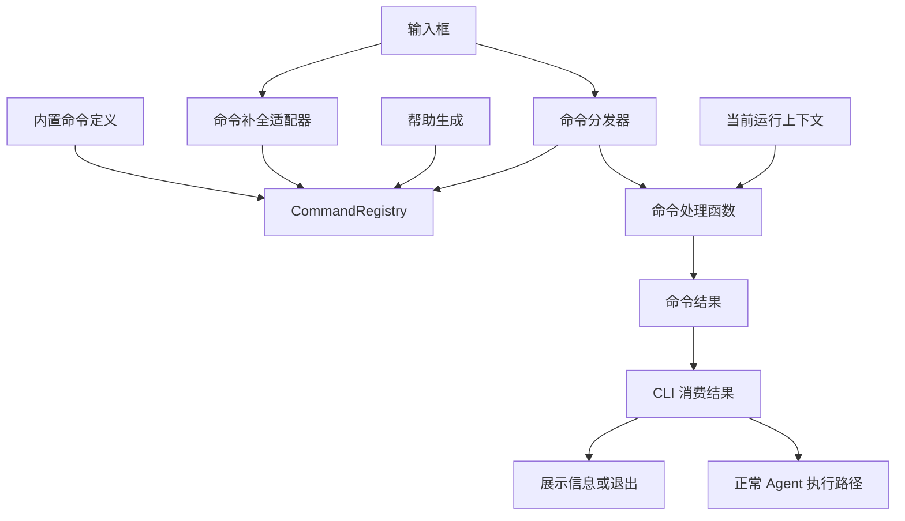

# Mole 斜杠命令系统架构设计

- 状态：已实现基础版本，部分设计待完善
- 设计日期：2026-09-23
- 实现状态更新：2026-09-24
- 范围：交互式 CLI 的斜杠命令注册、发现、补全和分发
- 技术方向：显式命令注册表 + 现有 prompt_toolkit 输入框

## 1. 背景与目标

设计前，用户输入 `/` 时缺少可以直接发现命令的菜单。当前已实现菜单、统一注册表和模型参数补全，并接入上游新增的 `/history`、`/resume`。后续的会话增强、Plan/Build 模式和审批管理仍需要方便扩展的命令入口。

本设计解决两个问题：用户不必记忆命令；开发者新增命令时不必修改输入主循环、菜单生成和帮助生成逻辑。

主要目标：

1. 输入 `/` 自动展示命令及说明，继续输入时过滤候选。
2. 菜单、帮助和执行使用同一份命令定义。
3. 支持命令别名、异步处理函数和可选参数补全。
4. 为会话切换、模式切换等有状态操作提供正确的上下文。
5. 保留现有命令行为，控制第一版改动规模。

本期不实现第三方 Python 插件加载、目录扫描、热重载、提示词文件命令、多级子命令框架或新的终端 UI 框架。会话恢复等业务功能仍按各自方案实施，本设计只提供其命令入口。

## 2. 决策与取舍

选择 **Pi 风格的显式命令注册接口**，借鉴 Codex 的统一命令元数据和共享可用性规则，保留未来接入 OpenCode 风格提示词命令的可能性。

| 方案 | 优点 | 本项目的取舍 |
| --- | --- | --- |
| 持续增加 CLI 条件分支 | 初始实现最直接 | 新增命令容易同时修改菜单、帮助、执行，不采用 |
| Codex 风格的内置命令枚举 | 内置命令类型明确，规则集中 | 采用统一元数据思路，不照搬枚举作为扩展入口 |
| Pi 风格的函数注册 | 处理函数、说明、参数补全可以一起注册 | 作为主要方案，适合即将增加的状态操作命令 |
| OpenCode 风格的提示词文件 | 用户无需写代码即可增加任务快捷入口 | 后续考虑；提示词本身不能直接实现会话切换等应用操作 |
| 完整插件系统 | 支持第三方分发与动态加载 | 引入加载、兼容、生命周期等额外问题，本期不做 |

选择依据是 Mole 当前需要快速演示，同时还会持续增加内置功能。显式注册能满足扩展要求，不必先建设一个插件平台。prompt_toolkit 已用于输入交互，继续复用它可以缩小改动范围。

## 3. 系统边界

斜杠命令系统属于 Mole 的交互与编排层。它不属于模型工具列表，不作为 openJiuwen Rail，也不让模型决定如何解释 `/new`、`/model` 等控制命令。

命令处理器通过 Mole 当前运行上下文调用业务能力；Agent 执行仍由已有 openJiuwen 集成承担。需要模型参与的命令，例如 `/review`，返回明确的 Agent 请求，由 CLI 走正常执行路径。



## 4. 核心实体与契约

以下实体已在 `mole_agent/commands/` 中实现；涉及后续扩展的内容单独标注。

### 4.1 CommandSpec

| 字段 | 含义 |
| --- | --- |
| `name` | 主名称，不含 `/` |
| `description` | 菜单和帮助使用的简短说明 |
| `handler` | 异步命令处理函数 |
| `usage` | 用法与参数说明 |
| `aliases` | 可选别名 |
| `complete_args` | 可选参数补全函数 |
| `availability` | 可选的纯查询函数，返回不可用原因；返回 `None` 表示可用 |
| `examples` | 可选的调用示例与说明，随命令一起维护 |

第一版来源全部是内置命令，暂不引入 `source` 字段；未来加入第二种命令来源时再增加。暂不添加未实际使用的分类、权限声明或多级参数 schema。

### 4.2 CommandRegistry

注册表负责注册、名称与别名解析、列举和前缀匹配，不执行命令，不直接渲染终端。

- 注册时验证名称格式，并检查主名称和别名之间的所有冲突。
- 重复注册直接报错，不允许静默覆盖。
- 保持显式注册顺序，作为稳定的默认菜单顺序。
- 别名参与解析和匹配，但帮助默认展示主名称，避免重复条目。
- 默认注册表在 CLI 初始化时组装，不使用进程全局可变单例。

### 4.3 CommandContext

处理函数接收执行时创建的上下文。当前 `CommandContext` 提供 `actions` 操作映射和 `candidates` 本地候选查询；内置命令通过 `ctx.actions[name]` 适配 CLI 中的用量、模型和会话操作。独立服务接口和直接绑定业务处理函数的整理尚未实施。

上下文不直接暴露整个 Repl，也不保存供未来重复使用的旧 Agent 引用。会话切换后，后续命令必须获得新上下文；切换命令本身不应继续使用切换前取得的会话对象。

第一版只提取现有命令实际依赖的能力，不提前搭建完整服务层。上下文是收窄依赖的边界，不是容纳所有对象的容器。

### 4.4 CommandResult

处理函数返回显式结果，由 CLI 消费：

| 结果 | 含义 | 典型用途 |
| --- | --- | --- |
| `Message` | 展示内容并继续等待输入 | 用法提示、错误信息 |
| `AgentPrompt` | 通过正常路径提交 Agent 请求 | `/review` |
| `Exit` | 请求有序退出 | `/exit` |
| `Help` | 返回帮助章节，由展示层应用样式 | `/help` |

帮助由独立的 `commands/help.py` 组合：命令列表与示例读取注册表，快捷键、项目约定和子 Agent 说明使用静态段落。注册表不负责生成帮助文本。Rich 样式只由帮助展示函数添加，命令说明保持普通文本。

需要选择模型等多步交互时，处理函数可以使用上下文中的交互接口，完成后返回结果。处理函数不直接调用 `sys.exit()`，也不另起一套 Agent 执行循环。

## 5. 输入与补全

### 5.1 命令名补全

仅当输入行以 `/` 开头且光标位于相应补全区域时触发。普通文本中的路径不触发。第一版采用前缀匹配，不引入模糊匹配排序。

| 输入 | 行为 |
| --- | --- |
| `/` | 展示所有公开主命令和说明 |
| `/mo` | 展示 `/model`、`/models` |
| `/model ` | 转交模型参数补全函数 |
| 普通文本或文本中的路径 | 不启动命令菜单 |

当前命令名补全替换光标前的命令文本；参数补全替换光标前的整个参数文本。光标处于词中间时不提供候选，避免残留词尾。现有实现适用于模型等单参数候选，多参数的局部替换仍需扩展。

### 5.2 参数补全

命令自行提供参数候选，补全器负责转换为 prompt_toolkit 的显示对象。业务侧候选包含插入值、展示标签和说明，不依赖终端库类型。

接口允许异步候选，但第一版已有模型等候选优先使用本地轻量查询。补全不调用模型、不执行命令、不改变会话状态。若后续加入异步查询，必须取消或丢弃旧输入对应的过期结果，避免候选回跳。

`/history`、`/resume` 已接入命令名补全和分发，但会话参数仍需手动输入。后续可为 `/resume` 提供展示标题和时间、实际填入会话 ID 的候选。

### 5.3 键盘行为

- 输入 `/` 自动打开菜单；继续输入时更新候选。
- 上下方向键选择，Tab 补全。
- 有明确选中候选时，Enter 只确认补全；再次 Enter 提交。
- 没有选中候选时，Enter 提交当前输入。
- Esc 关闭菜单，不清空输入。

菜单打开不默认选中第一个命令，避免 Enter 意外选择命令。上述语义需要显式验证，不假设终端库默认行为完全符合要求。

## 6. 分发、状态与错误处理

提交后先区分普通文本和斜杠命令。斜杠命令解析为名称和剩余参数文本，解析主名称或别名，再取得当前上下文并执行处理函数。

参数保留原始文本，不对所有命令统一做 shell 拆词，避免破坏 `/review` 等自由文本参数。需要结构化参数的命令自行解析，必要时复用小型辅助函数。

`availability(ctx)` 返回 `None` 表示可用，否则返回不可用原因。菜单可展示不可用条目及原因，分发器必须在执行前重新检查，不能只相信菜单生成时的状态。检查应是轻量、无副作用的查询；它不替代后续工具审批或权限系统。

第一版沿用现有串行 REPL 的执行方式，不增加模型运行期间并发修改会话的能力。若未来允许运行中输入控制命令，需要再定义排队、取消与互斥规则。

| 情况 | 处理 |
| --- | --- |
| 未知命令 | 展示错误和可能匹配项，不发给模型 |
| 参数错误 | 展示该命令用法，不发给模型 |
| 当前不可用 | 展示原因，不执行处理函数 |
| 处理失败 | 展示明确错误，保留后续输入能力 |
| 取消 | 遵循现有取消和清理路径，不当作普通错误吞掉 |
| 注册冲突 | 初始化时报错，避免运行到一半才发现 |

命令成功与否由业务操作结果决定，不能仅因为分发成功就显示操作成功。

## 7. 模块组织与接入方式

```text
mole_agent/
├── commands/
│   ├── types.py          # 定义、上下文契约、结果和候选
│   ├── registry.py       # 注册、查找、冲突检查
│   ├── dispatcher.py     # 名称解析、可用性校验、执行
│   ├── completion.py     # prompt_toolkit 适配
│   ├── help.py           # 帮助章节组合与展示
│   └── __init__.py       # 内置命令定义、适配处理器与默认注册表
└── cli.py                # 输入循环、上下文创建、结果消费
```

当前模型和会话业务处理逻辑仍在 `cli.py`，由 `Repl.command_context()` 提供操作映射；尚未拆出 `builtin.py`、`models.py` 或 `sessions.py`。后续可按职责拆分，不强制每个命令单独一个文件。

新增命令的流程：

1. 编写异步处理函数。
2. 在默认注册表组装入口注册 `CommandSpec`；若沿用内置命令的操作映射，还需在 `Repl.command_context()` 中接入对应操作。
3. 有参数候选时提供补全函数，有状态限制时提供可用性判断。
4. 验证业务行为；菜单、帮助、执行入口自动读取定义。

不要求修改 CLI 主循环、菜单生成代码或帮助命令列表。若新增能力需要注入新的业务依赖，可以扩展上下文和初始化组装，但不应扩展通用分发器的命令分支。

## 8. 实施顺序与验收

基础版本已完成以下三步；多参数局部替换、会话参数候选和业务处理器拆分仍待完善：

1. 引入注册表和分发器，迁移现有命令，保持行为一致。
2. 接入菜单和参数补全，帮助信息改为从注册表生成。
3. 验证键盘操作、状态判断、异常路径以及新增命令的接入成本。

关键验收场景：

- `/` 展示命令及说明，`/mo` 正确过滤。
- 主名称和别名正确解析，冲突在注册时被发现。
- 补全操作不会执行命令；Enter、Tab、Esc 符合约定。
- 当前验证单参数候选的替换和词中间不补全；多参数局部替换作为后续验收项。
- `/review` 仍走正常 Agent 执行路径，普通文本行为不变。
- 未知命令、错误参数不会被提交给模型。
- 状态在展示菜单后发生变化时，执行前校验仍能阻止不可用操作。
- 使用测试命令验证：只增加处理函数和注册项即可被菜单、帮助和分发发现。

无需在这一阶段完成会话恢复、模式切换和审批升级，也不把这些业务功能的验收计入命令系统完成标准。

## 9. 参考与证据边界

参考核对日期为 2026-09-23。以下为公开源码和官方文档的定向阅读，没有运行这些工具验证终端行为；主分支链接可能随版本变化。本设计是对其思想的取舍，不声称复制它们的完整实现。

| 参考 | 核对到的机制 | 本设计采用内容 |
| --- | --- | --- |
| [Codex SlashCommand](https://github.com/openai/codex/blob/main/codex-rs/tui/src/slash_command.rs) | 内置命令枚举、说明、参数支持等元数据；枚举顺序参与展示 | 命令定义集中、顺序明确 |
| [Codex 共享命令过滤](https://github.com/openai/codex/blob/main/codex-rs/tui/src/bottom_pane/slash_commands.rs) | 输入框与弹窗共享命令过滤规则 | 展示与执行共享可用性规则；这是 Mole 的进一步设计选择 |
| [Pi 命令接口](https://github.com/earendil-works/pi/blob/main/packages/coding-agent/src/core/extensions/types.ts) | registerCommand、异步 handler、可选异步参数补全 | 显式注册接口和补全扩展点 |
| [Pi 扩展文档](https://github.com/badlogic/pi-mono/blob/main/packages/coding-agent/docs/extensions.md) | 命令专用上下文、会话切换与上下文生命周期 | 执行时取得当前上下文，不复用旧会话引用 |
| [OpenCode 自定义命令](https://opencode.ai/docs/commands/) | Markdown/JSON 提示词命令、参数替换、模型与 Agent 配置 | 未来提示词命令可转换为 AgentPrompt 接入 |

本设计中的统一 `CommandResult`、默认重名拒绝、前缀匹配和 Enter 两阶段确认，是针对 Mole 的决策，不视作上述工具的共同实现。
